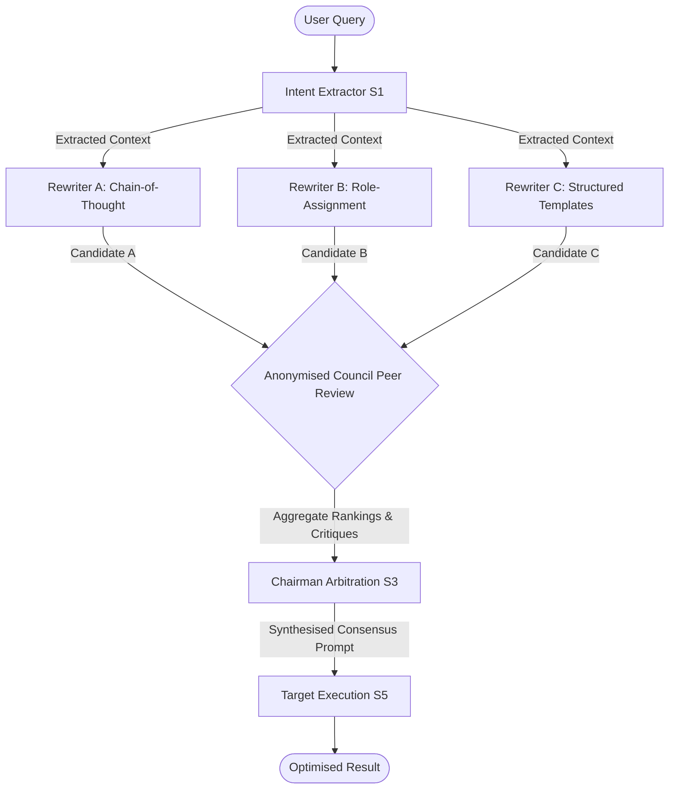

# ConsensusPrompt ⚖️

<p align="center">
  <em>Enterprise-grade, Multi-Agent Prompt Optimisation Middleware</em>
</p>

## Executive Summary
**ConsensusPrompt** is an advanced prompt optimization middleware designed to democratize high-quality prompt engineering. Instead of relying on a single static LLM to rewrite user input, ConsensusPrompt instantiates a miniature society of AI agents that independently draft, review, and evaluate prompt variations to synthesize an objectively superior result.

By utilizing a **Peer-Review Council Protocol**, the system systematically removes single-model bias and guarantees high-fidelity, bulletproof prompts.

---

## 🏗 System Architecture

The backbone of ConsensusPrompt is an orchestrated graph of specialized agents operating in sequential and parallel phases.



### 1. Intent Extraction (S1)
The user's initial query is parsed by a dedicated extraction agent to identify the explicit domain, the central intent, and crucially, any implicit missing constraints that need to be addressed.

### 2. Parallel Generation (S2)
Three independent Autonomous Prompt Engineers (Rewriters) generate diverse perspectives:
- **Candidate A:** Specialises in Chain-of-Thought reasoning scaffolds.
- **Candidate B:** Specialises in contextual Role-Assignment and Few-Shot formatting.
- **Candidate C:** Specialises in strict Structured Domain Templates (e.g., Clinical, Legal).

### 3. Anonymised Council Review (S3a & S3b)
A multi-agent Cross-Examination Council evaluates the candidates. Candidates are completely anonymized to prevent model-affinity bias. The council scores and ranks candidates simultaneously on Clarity, Completeness, Faithfulness, and Domain Fit.

### 4. Chairman Arbitration (S3c)
The Chairman Agent ingests all peer-review ballots, logic critiques, and aggregate rankings. It elects to either forward the unanimous winning prompt or intelligently synthesize a hybrid configuration bridging the strongest elements of all contenders.

---

## 🚀 Key Features

*   **Dynamic Flowchart Visualization:** The Next.js frontend features a stunning 2D data-flow diagram constructed with animated SVG bezier curves and React Three Fiber, visually narrating the hidden council review operation to the end user in real-time.
*   **Agnostic LLM Routing:** Configure OpenRouter (`meta-llama`, `qwen`, `claude`) for individual council members while relying on `gemma-3-1b-it` natively for zero-latency arbitration.
*   **Local Analytics Persistence:** Built-in persistence layer (`feedback.json`, `optimisation_insights.json`) captures and parses user rating metrics (quality, trust, control) to evaluate council historical performance.
*   **Full Theme Support:** Fully styled Light/Dark mode UI components built natively with React.

---

## 🛠 Tech Stack

*   **Backend:** FastAPI, Python 3.9+, LangChain, Uvicorn
*   **Frontend:** Next.js 14, React 18, React Three Fiber, Framer Motion
*   **AI Integrations:** `langchain-google-genai`, `langchain-openai` (OpenRouter API base)

---

## 💻 Installation & Quick Start

### 1. Backend Setup

```bash
cd consensusprompt/backend

# Ensure you use native Apple Python to avoid Rosetta/Gatekeeper conflicts on M-series Macs
/usr/bin/python3 -m venv venv
source venv/bin/activate

# Install core dependencies
pip install -r requirements.txt
pip install -U langchain-google-genai langchain-openai google-generativeai
```

Create a `.env` file in the `backend/` directory:
```env
GOOGLE_API_KEY=your_gemini_api_key
OPENROUTER_API_KEY=your_openrouter_api_key
```

Run the backend server:
```bash
python3 -m uvicorn main:app --port 8000 --reload
```

### 2. Frontend Setup

Open a new terminal tab:
```bash
cd consensusprompt/frontend

npm install
npm run dev
```

Navigate to [http://localhost:3000](http://localhost:3000) to access the ConsensusPrompt dashboard.

---

## 📂 Project Structure

*   **/backend/agents/**: Individual LLM definitions (Intent, Arbitrator, Council members, Rewriters).
*   **/backend/pipeline/graph.py**: The LangChain orchestrator managing parallel state transitions.
*   **/backend/config.py**: Model provisioning map (easily swap Llama 3.2, Gemma, Qwen).
*   **/frontend/app/CouncilScene.tsx**: The animated node-link interactive diagram.
*   **/frontend/app/page.tsx**: The primary React application controller managing pipeline stage traversal.
