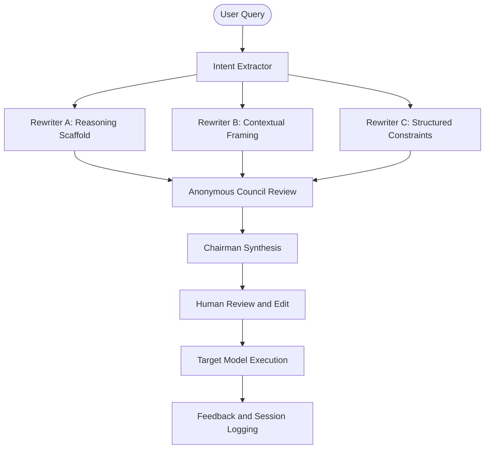

# ConsensusPrompt

<p align="center">
  <em>Multi-agent prompt optimisation with peer review, human approval, and local analytics.</em>
</p>

## Overview
ConsensusPrompt is a FastAPI + Next.js application that rewrites a user prompt through three different prompt-engineering strategies, has a small council of reviewers rank the results anonymously, and synthesizes a final consensus prompt for human approval before execution.

The current implementation is built around OpenRouter-backed model calls, a local JSON persistence layer, and a frontend that exposes the full council flow: processing, deliberation, review, execution, and feedback.

## Current Pipeline


### Stages
1. Intent extraction parses the raw request into domain, likely output shape, missing information, and constraints.
2. Three rewriters generate competing prompt candidates from different optimization perspectives.
3. Three reviewers rank the anonymized candidates.
4. The chairman synthesizes the final prompt from the candidates, reviews, rankings, and prior same-domain feedback memory.
5. The user reviews and optionally edits the final prompt.
6. The approved prompt is executed against a chosen target model.
7. Feedback and session metadata are persisted locally for analytics and future chairman guidance.

## Prompt Policy
The active prompt system now enforces a few important defaults across the rewriters and chairman:

- Do not silently substitute a different model when the configured one fails.
- Do not convert the task into a request for more user-supplied materials such as PDFs, URLs, uploads, or DOIs.
- Do not introduce strict brevity constraints, single-paragraph requirements, word limits, or bullet-count caps unless the user explicitly asked for them.
- For summarization tasks, prefer structured output with sections, headings, or bullets rather than collapsing everything into one paragraph.
- For research-domain tasks, preserve enough space for findings, methodology, limitations, evidence, and uncertainty.

## Key Features
- Three distinct rewriting strategies with anonymous peer review.
- Streaming backend progress for the optimization pipeline.
- Human-in-the-loop review before any execution happens.
- Domain-sensitive safety checks before execution.
- Optional compare mode: raw query output vs optimized-prompt output.
- Local persistence for sessions, ratings, analytics, and prompt-memory signals.
- Session history and export to JSON or CSV.

## Tech Stack
- Backend: FastAPI, Python 3.9+, LangChain, Uvicorn
- Frontend: Next.js 14, React 18, TypeScript
- Model transport: OpenRouter via `langchain-openai`
- Persistence: local JSON files in `backend/`

## Repository Structure
- `backend/main.py`: API routes for optimize, execute, safety checks, feedback, sessions, and exports.
- `backend/pipeline/graph.py`: main pipeline orchestration and execution path.
- `backend/agents/`: intent extractor, three rewriters, and council/chairman logic.
- `backend/live_mode_utils.py`: OpenRouter invocation and structured-output helpers.
- `backend/feedback_memory.py`: same-domain feedback examples for chairman synthesis.
- `backend/adaptation_memory.py`: same-domain acceptance/override summaries for chairman synthesis.
- `backend/session_store.py`: local session persistence and analytics.
- `frontend/app/page.tsx`: main multi-stage application UI.
- `frontend/app/CouncilScene.tsx`: council visualization component.

## Setup

### Backend
```bash
cd backend
/usr/bin/python3 -m venv venv
source venv/bin/activate
pip install -r requirements.txt
```

Create `backend/.env`:
```env
OPENROUTER_API_KEY=your_openrouter_api_key

# Optional per-role overrides
MODEL_INTENT=google/gemma-3n-e4b-it:free
MODEL_REWRITER_A=google/gemma-3n-e4b-it:free
MODEL_REWRITER_B=openai/gpt-oss-20b:free
MODEL_REWRITER_C=meta-llama/llama-3.3-70b-instruct
MODEL_REVIEWER_A=google/gemma-3n-e4b-it:free
MODEL_REVIEWER_B=openai/gpt-oss-20b:free
MODEL_REVIEWER_C=meta-llama/llama-3.3-70b-instruct
MODEL_CHAIRMAN=openai/gpt-oss-20b:free

# Optional execution targets exposed in the UI
TARGET_MODEL_PRIMARY=google/gemma-3n-e4b-it:free
TARGET_MODEL_SECONDARY=openai/gpt-oss-20b:free
TARGET_MODEL_TERTIARY=meta-llama/llama-3.3-70b-instruct
TARGET_MODEL_ROUTER=openrouter/free
```

Run the backend:
```bash
python3 -m uvicorn main:app --port 8000 --reload
```

### Frontend
```bash
cd frontend
npm install
npm run dev
```

Open [http://localhost:3000](http://localhost:3000).

If needed, point the frontend at a different backend with:
```env
NEXT_PUBLIC_API_URL=http://localhost:8000
```

## API Surface
- `GET /api/health`: health check
- `GET /api/config`: configured council and target models
- `POST /api/optimize`: run the pipeline synchronously
- `POST /api/optimize/stream`: run the pipeline with streaming progress events
- `POST /api/execute`: execute an approved prompt against a target model
- `POST /api/safety-check`: run heuristic safety checks
- `POST /api/feedback`: persist ratings and session context
- `GET /api/sessions`: list saved sessions
- `GET /api/sessions/analytics`: aggregate homepage analytics
- `GET /api/sessions/export/json`: export saved sessions as JSON
- `GET /api/sessions/export/csv`: export saved sessions as CSV

## Data Files
The app currently uses local JSON files in `backend/`:

- `feedback.json`: lightweight feedback entries
- `sessions.json`: full saved study sessions
- `optimisation_insights.json`: historical winning-perspective log
- `structured_parse_failures.json`: failed structured-output captures

These files are part of the runtime state and should be treated as application data, not just sample artifacts.

## Current Limitations
- No database; persistence is local and file-based.
- No automated test suite beyond basic code compilation and manual flows.
- Some legacy files still exist, such as `backend/agents/arbitrator.py`, but the active path uses the council/chairman flow.
- The frontend is still concentrated in a large single page component and could be refactored further.

## Development Notes
- Restart the backend after changing prompt templates or model configuration.
- The pipeline now fails explicitly if a configured model is unavailable instead of silently substituting a different one.
- Reviewer parsing expects exactly three distinct ranked candidates from each review.
