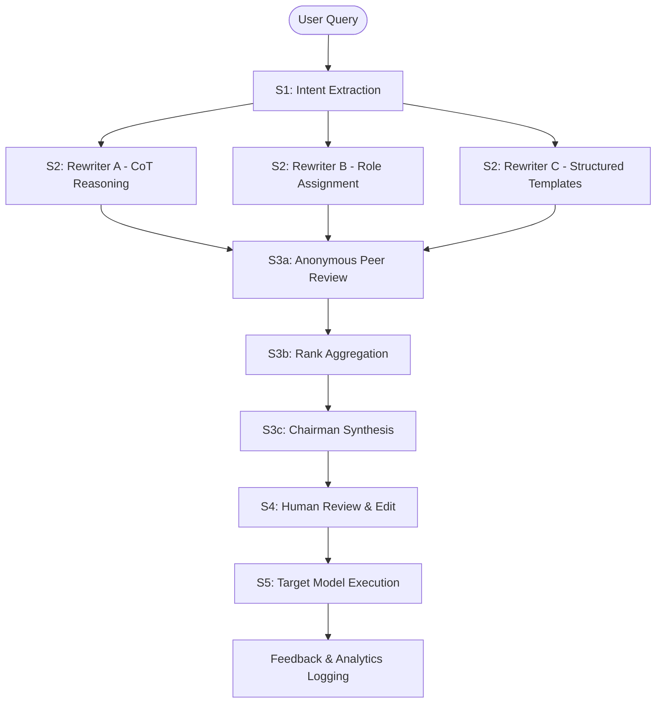

# ConsensusPrompt: A Multi-Agent Middleware for Human-Centred Prompt Optimisation

<p align="center">
  <em>Applying anonymous peer review to prompt engineering to improve output quality, trust, and user control.</em>
</p>

## Overview

Large language models are highly sensitive to how a query is phrased, yet most users do not have prompt engineering skills, and existing single-model rewriting tools are opaque and biased toward one model’s generation style. 

**ConsensusPrompt** is a multi-agent middleware that applies a peer review process to prompt optimisation. Three rewriter agents independently reformulate the user query using distinct strategies. An anonymous council of three reviewer LLMs ranks the candidates, and a chairman model synthesises the final prompt from the top-ranked candidate and prior session feedback. The human user reviews and approves the prompt before any execution takes place.

Across 13 controlled user sessions, the system achieved mean trust and control ratings of 4.77 and 4.85 out of 5, and **no user overrode the council’s top-ranked candidate**. An ablation study showed that a diverse 5-model configuration achieved a 25.5% relative improvement in consensus strength at negligible latency cost.

---

## Key Features

- **Parallel Strategy Rewriting**: Queries are rewritten simultaneously using Chain-of-Thought reasoning, Role Assignment with Few-Shot examples, and Structured Templates.
- **Anonymous Peer Review**: Three reviewer LLMs rank candidates blindly, eliminating model-affinity bias and herd behavior.
- **Human-in-the-Loop Control**: Users are presented with a visual Diff view, compare mode, and full reviewer rationale. Nothing executes without explicit human approval.
- **Dynamic Feedback Memory**: The Chairman LLM actively learns from user edits and acceptance behavior, adapting future syntheses to domain conventions and user preferences.
- **Domain-Sensitive Safety Checks**: Heuristic safety checks block or warn users before executing high-risk or sensitive prompts.
- **Streaming Pipeline Engine**: Real-time progress events are streamed to the frontend via Server-Sent Events, complete with a dynamic council visualization.

---

## System Architecture

ConsensusPrompt runs a five-stage sequential pipeline orchestrated by LangGraph and FastAPI.


```mermaid
graph TD
    User([User Query]) --> S1[S1: Intent Extraction]
    S1 --> RA[S2: Rewriter A - CoT Reasoning]
    S1 --> RB[S2: Rewriter B - Role Assignment]
    S1 --> RC[S2: Rewriter C - Structured Templates]
    RA --> Council[S3a: Anonymous Peer Review]
    RB --> Council
    RC --> Council
    Council --> Agg[S3b: Rank Aggregation]
    Agg --> Chairman[S3c: Chairman Synthesis]
    Chairman --> Human[S4: Human Review & Edit]
    Human --> Execute[S5: Target Model Execution]
    Execute --> Feedback[Feedback & Analytics Logging]
```

### The Five Stages
1. **S1: Intent Extraction**: Parses the raw request into domain, likely output shape, missing information, and constraints.
2. **S2: Parallel Rewriting**: Three agents generate competing prompt candidates from different optimization perspectives.
3. **S3a/b: Anonymous Review & Aggregation**: Three distinct reviewers blindly rank the anonymized candidates. Consensus strength and reviewer agreement are computed.
4. **S3c: Chairman Synthesis**: The Chairman synthesizes the final prompt from the winning candidate, peer critiques, and same-domain feedback memory.
5. **S4/S5: Human Approval & Execution**: The user reviews, optionally edits, and executes the final prompt against a target model. Feedback is persisted locally.

---

## Key Findings & Study Results

Based on our user study (n=13) and longitudinal optimisation logs (n=104):

1. **Multi-agent peer review builds trust.** Mean trust was 4.77/5, and the consensus override rate was exactly 0%.
2. **Domain determines the winning strategy.** Structured Templates win 94.1% of healthcare sessions. Chain-of-Thought leads in general/research contexts. Role Assignment leads in education. No single strategy dominates across all domains.
3. **Human edits are deliberate.** Users trust the council's winner selection. When edits occur, they are minor adjustments to tone and structure (mean edit shift: 4.1%).
4. **Optimal Configuration.** Expanding from 3 to 5 rewriters raised consensus strength from 62.9% to 78.9% (a 25.5% relative gain) at a latency cost of under 6 seconds, thanks to parallelization.

---

## Tech Stack

- **Backend**: Python 3.9+, FastAPI, LangChain, LangGraph, Uvicorn
- **Frontend**: Next.js 14, React 18, TypeScript, Vanilla CSS
- **Model Transport**: OpenRouter via `langchain-openai` API
- **Persistence**: Local JSON storage (`sessions.json`, `feedback.json`)

---

## Repository Structure

- `backend/main.py`: API routes for optimize, execute, safety checks, feedback, sessions, and exports.
- `backend/pipeline/graph.py`: Main pipeline orchestration and execution path.
- `backend/agents/`: Intent extractor, three rewriters, and council/chairman logic.
- `backend/live_mode_utils.py`: OpenRouter invocation and structured-output helpers.
- `backend/feedback_memory.py`: Same-domain feedback examples for chairman synthesis.
- `backend/adaptation_memory.py`: Same-domain acceptance/override summaries for chairman synthesis.
- `backend/session_store.py`: Local session persistence and analytics.
- `frontend/app/page.tsx`: Main multi-stage application UI.
- `frontend/app/CouncilScene.tsx`: Council visualization component.

## Data Files

The application uses local JSON files in `backend/` for lightweight persistence:
- `feedback.json`: User feedback entries and prompt edit histories.
- `sessions.json`: Full saved study sessions including agent logic and rankings.
- `optimisation_insights.json`: Historical winning-perspective logs.
- `structured_parse_failures.json`: Failed structured-output captures.

---

## Instructions to Replicate

### 1. Clone & Setup Backend

```bash
cd backend
python3 -m venv venv
source venv/bin/activate
pip install -r requirements.txt
```

Create a `backend/.env` file with your OpenRouter API key and model configuration:
```env
OPENROUTER_API_KEY=your_openrouter_api_key

# Model Configuration
MODEL_INTENT=openai/gpt-5.4-nano
MODEL_REWRITER_A=google/gemini-2.5-flash
MODEL_REWRITER_B=openai/gpt-5.4-nano
MODEL_REWRITER_C=deepseek/deepseek-v3.2
MODEL_REVIEWER_A=google/gemini-2.5-flash
MODEL_REVIEWER_B=openai/gpt-5.4-nano
MODEL_REVIEWER_C=deepseek/deepseek-v3.2
MODEL_CHAIRMAN=nvidia/nemotron-3-super-120b-a12b

# Execution Targets exposed in the UI
TARGET_MODEL_PRIMARY=tencent/hy3-preview:free
TARGET_MODEL_SECONDARY=google/gemma-3n-e4b-it:free
TARGET_MODEL_TERTIARY=meta-llama/llama-3.3-70b-instruct
```

Run the FastAPI server:
```bash
python3 -m uvicorn main:app --port 8000 --reload
```

### 2. Setup Frontend

Open a new terminal window:
```bash
cd frontend
npm install
npm run dev
```

Open [http://localhost:3000](http://localhost:3000) in your browser.

*Note: If your backend is hosted elsewhere, configure `NEXT_PUBLIC_API_URL=http://your-backend-url` in a `frontend/.env.local` file.*

---

## Contributors

- **Prit Mhala** (pmhala@cs.stonybrook.edu)
- **Aditya Patel** (adapatel@cs.stonybrook.edu)
- **Dhruv Patel** (dhruvnpatel@cs.stonybrook.edu)

Department of Computer Science, Stony Brook University (CSE 590.03)
